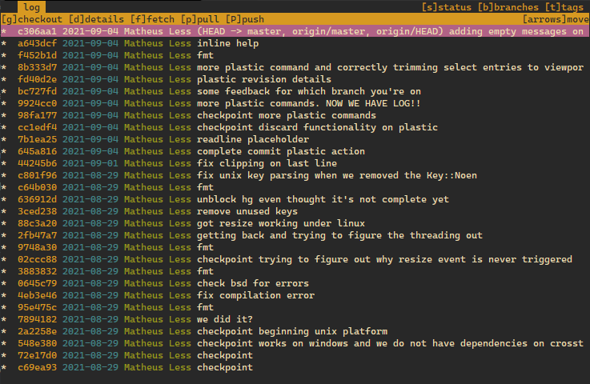
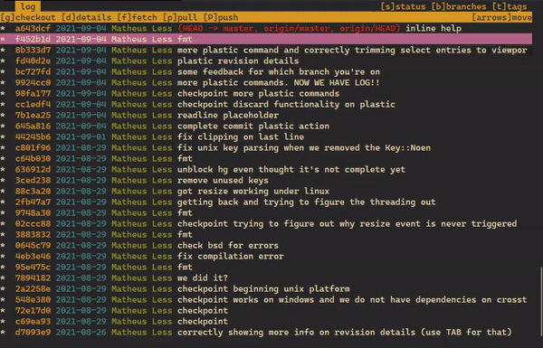

# verco
A simple Git/Mercurial/PlasticSCM tui client based on keyboard shortcuts

## Screenshots




## Platforms

This project uses Cargo and pure Rust stable and works on latest versions of Windows, Mac, Linux and BSD.

Its only dependencies are:
- [winapi](https://crates.io/crates/winapi) (windows only)
- [libc](https://crates.io/crates/libc) (unix only)

## Install

You can either install it via `cargo` or download the binaries from github releases.

If you go the `cargo` route, you need to have it installed (usually using [rustup](https://www.rustup.rs/)).
In a terminal, run this command to install `verco`:

```
cargo install verco
```

Then you'll be able to run `verco` from whichever directory you in.

### Packaging status

#### Fedora ([COPR](https://copr.fedorainfracloud.org/coprs/atim/verco/))

```
sudo dnf copr enable atim/verco -y
sudo dnf install verco
```

#### Arch Linux ([AUR](https://aur.archlinux.org/packages/verco/))

`verco` can be installed from the available [AUR packages](https://aur.archlinux.org/packages/?O=0&SeB=b&K=verco&outdated=&SB=n&SO=a&PP=50&do_Search=Go) using an [AUR helper](https://wiki.archlinux.org/index.php/AUR_helpers). For example:

```
paru -S verco
```

## Usage

In a terminal in a repository folder, type in the `verco` command.
It will launch `verco`'s tui and you'll be able to interface with Git/Mercurial/PlasticSCM.

