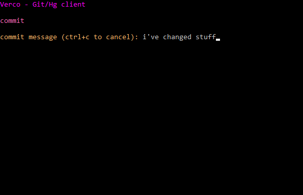
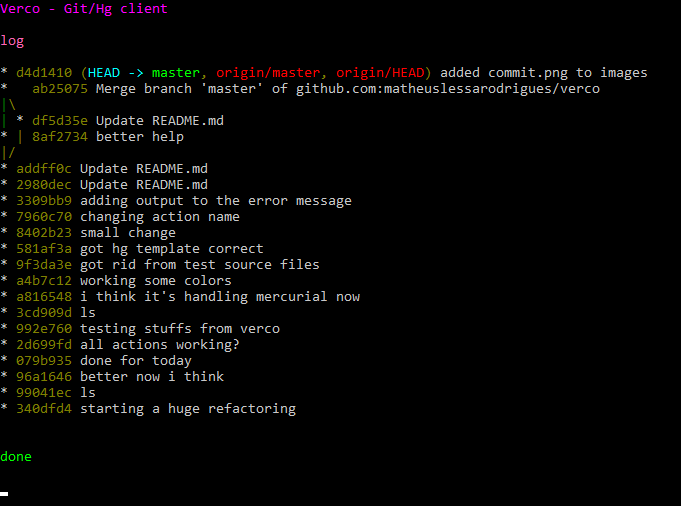

# verco
A simple Git/Hg version control client based on keyboard shortcuts

## Platforms

This project uses Cargo and pure Rust stable so Windows, Mac and Linux should work.

It depends on:
- [crossterm](https://crates.io/crates/crossterm)
- [ctrlc](https://crates.io/crates/ctrlc)

## Install

First of all, install rust into your system using [rustup](https://www.rustup.rs/).

Once it's installed, you can proceed to install verco using Cargo (Rust's package manager).
Open a terminal and run these commands to clone and install verco:

```
cargo install verco
```

Once you close and open again your terminal, you'll be able to use `verco` in whichever directory you need.
You can even delete that `verco` folder if you please.

## Usage

Open a terminal from your repository folder and type in `verco`.
It will launch verco and you can begin to use it.

Use your keyboard to perform git/hg actions (also, press `h` for help).

## Keymap

```
h               help

e               explorer

s               status
l               log

d               revision changes
shift+d         revision diff

c               commit all
shift+c         commit selected
x               revert all
shift+x         revert selected
u               update/checkout
m               merge

r               unresolved conflicts
shift+r         resolve taking other
ctrl+r          resolve taking local

f               fetch
p               pull
shift+p         push

shift+t         create tag

b               list branches
shift+b         create branch
ctrl+b          close branch
```

## Screenshots





